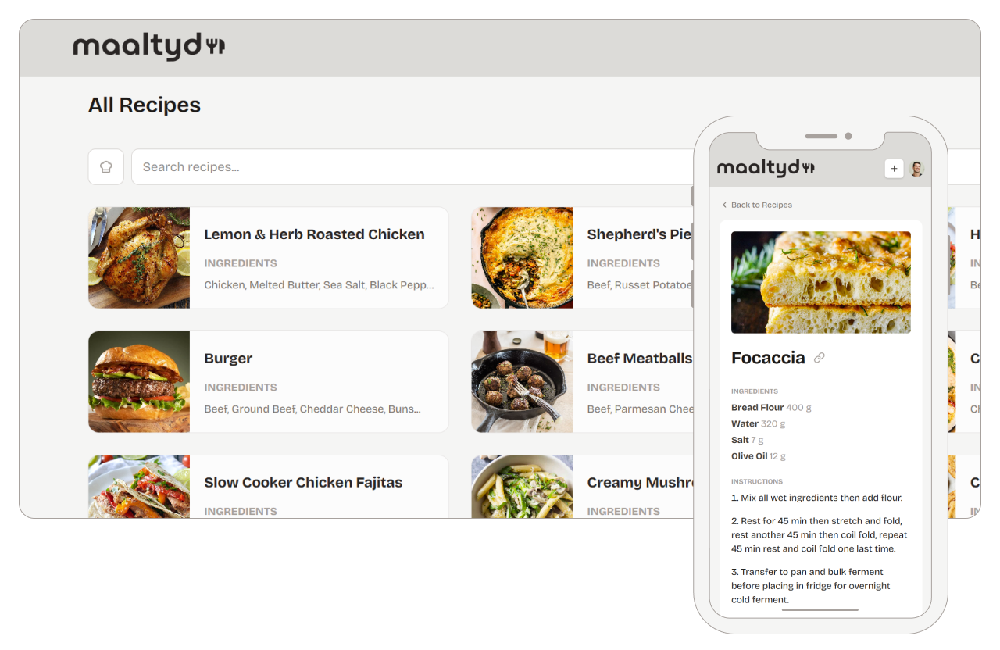

<p align="center">
  
</p>

# Maaltyd

**A Place For All Your Recipes**

Maaltyd is an intelligent web application designed to simplify your cooking and meal preparation. It helps you discover, create, and organize recipes with a streamlined, notecard-style experience. Whether you're importing recipes from your favorite food blogs or creating them from scratch, Maaltyd makes it easy.

## About The Project

Maaltyd is a recipe manager built with React and Vite, featuring a modern UI and quick filtering. Add recipes manually or import from URLs. Browse by ingredient, search by name, and filter by what you want to bake. Deploy to Vercel with serverless API routes for a simple, scalable setup.

## Key Features

- **Recipe Management:** Create recipes manually with title, main ingredient, ingredients list, and step-by-step instructions
- **Recipe Import:** Import recipes from URLs—Maaltyd extracts the relevant data automatically
- **Smart Filtering:** Filter recipes by main ingredient, search by title, and toggle a bake filter for flour-based recipes
- **Responsive Design:** Works seamlessly on desktop and mobile with a clean, modern interface
- **User Authentication:** Sign in with Clerk to add, edit, and delete your recipes

## Getting Started

### Prerequisites

- Node.js 18+
- npm or pnpm

### Installation

```bash
# Clone the repository
git clone https://github.com/your-username/maaltyd.git
cd maaltyd

# Install dependencies
npm install

# Set up environment variables (see .env.example)
# VITE_API_URL, VITE_CLERK_PUBLISHABLE_KEY, etc.

# Run development server
npm run dev
```

### Build

```bash
npm run build
npm run preview  # Preview production build
```

### Test

```bash
npm run test
npm run test:coverage  # With coverage report
```

## Tech Stack

- **Frontend:** React 18, TypeScript, Vite, Tailwind CSS, React Router
- **Backend:** Vercel Serverless Functions
- **Auth:** Clerk
- **Deployment:** Vercel